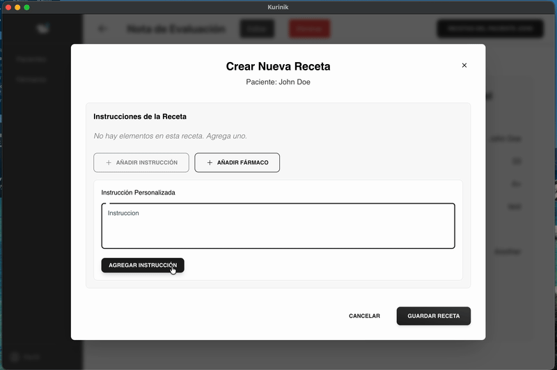
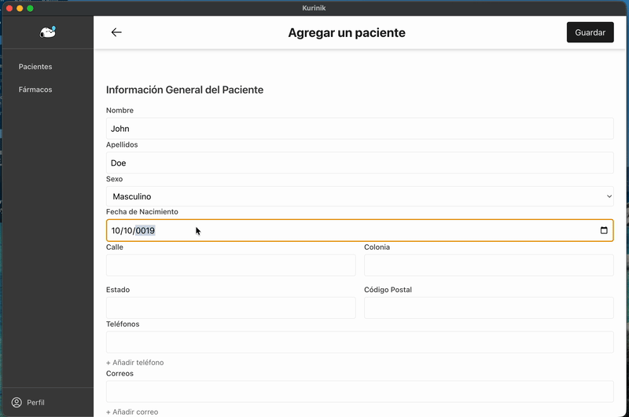
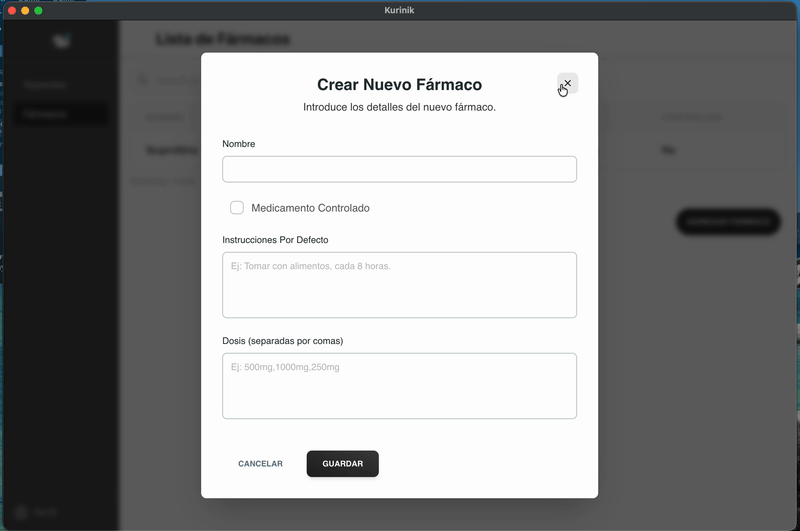
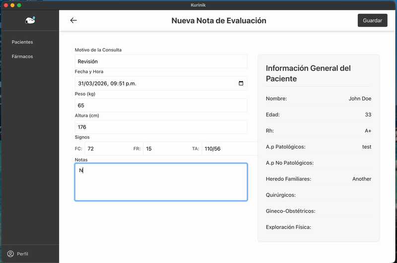
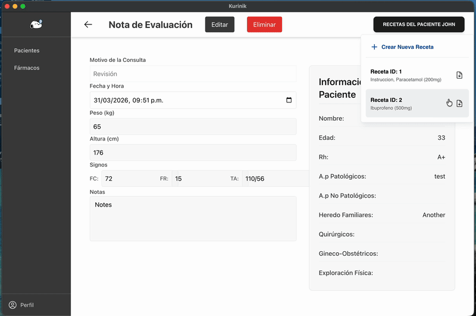

# 🏥 Kurinik

A full-stack desktop application built for real clinical use, managing medical records and patient data for an active clinic. Designed to run offline as a native desktop app on both macOS and Windows.

---

## 📸 Demo

### Creating a prescription (receta)


### Features

| Patient Data | Farmacos |
|---|---|
|  |  |

| Nota de Evaluación | Downloads |
|---|---|
|  |  |


---

##  Features

- 👤 **Patient management** — register and track complete patient profiles including contact info, address, and medical history
- 📋 **Notas de evaluación** — create and manage evaluation notes per patient visit
- 📄 **Recetas médicas** — generate medical prescriptions per consultation
- 💊 **Fármaco catalog** — maintain a catalog of medicines for fast addition to prescriptions
- 📝 **Word document generation** — export prescriptions as `.docx` files using customizable templates
- 🖥️ **Native desktop experience** — no browser required, runs as a standalone app
- 📦 **Fully offline** — no internet connection needed, all data stored locally
- 🪟 **Cross-platform** — macOS (ARM/Intel) and Windows

---

## 🛠️ Tech Stack

| Layer | Technology |
|---|---|
| Backend | Java · Spring Boot · Maven |
| Frontend UI | React · Tailwind CSS · Headless UI |
| Desktop shell | Electron |
| Database | SQLite |
| Document generation | docxtemplater · PizZip |
| Runtime | Bundled Temurin JRE (no Java install required for end users) |

> The app bundles a JRE so end users don't need Java installed. The Spring Boot backend runs as a local server, and Electron wraps the React frontend into a native window.

---

## 🏗️ Architecture

```
ServicioClinica/
├── backend/          # Spring Boot REST API (Java/Maven)
│   └── clinica/
│       └── src/
├── frontend/         # Electron shell + React UI
│   ├── main.js       # Electron main process — spawns backend JAR
│   ├── preload.js    # Electron preload script
│   └── react-frontend/  # React app (Tailwind CSS)
├── jre/              # Bundled JRE (not committed to git)
└── db/               # SQLite database (not committed to git)
```

The Electron app spawns the Spring Boot JAR on startup using the bundled JRE, then loads the compiled React frontend. All communication goes through a local REST API on `localhost:8080`.

---

## 🚀 Getting Started

### Prerequisites

- Node.js 18+
- Java 17+
- Maven 3.8+

### 1. Backend

```bash
cd backend/clinica
./mvnw package -DskipTests
```

### 2. Frontend (React)

```bash
cd frontend/react-frontend
npm install
npm run build
```

### 3. Desktop app (Electron)

```bash
cd frontend
npm install
npm run electron-start
```

> **Note:** The Electron app expects both the compiled JAR (`backend/clinica/target/clinica-0.0.1-SNAPSHOT.jar`) and the database file (`db/clinica.db`) to exist before it will launch. Build the backend first.

### Development workflow

If you only changed React code, skip step 1 and just rebuild the frontend before running Electron. For UI-only work you can also run `npm start` inside `react-frontend/` to use the React dev server in a browser (hot reload), but Electron-specific features like document generation and file downloads won't be available in that mode.

### Building distributables

```bash
# macOS
cd frontend
npm run dist

# Windows
npm run dist-win
```

---

## 🔒 Privacy & Data

This app was developed for and is actively used by a real clinic. The database and any patient data are **not included** in this repository. The `db/` folder and `jre/` bundle are excluded via `.gitignore`.

---

## 👤 Author

**Akira**  
Built as a real-world freelance project for an active medical clinic.

---

## 📄 License

This project is source-available for portfolio purposes. Please contact the author before reusing any part of it commercially.